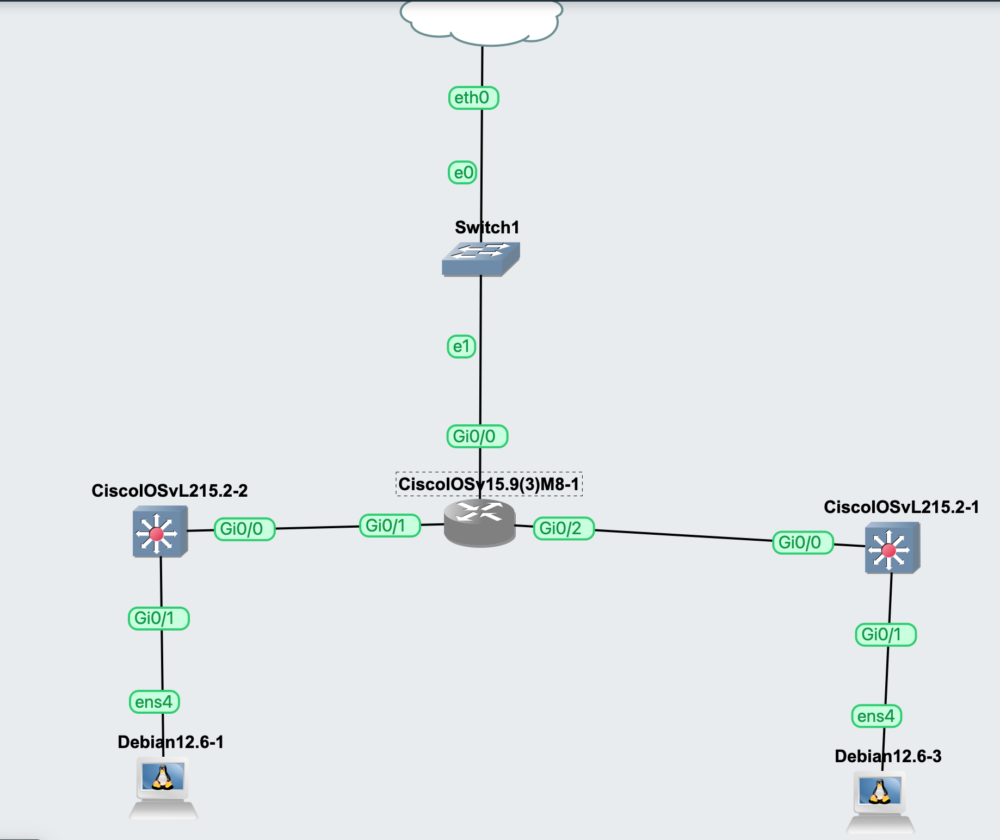

# Configuration d'un routeur avec deux réseaux LAN et NAT

> ⚠️ **Configuration ancienne :** cette configuration correspond à un ancien lab réalisé avec du matériel réseau ancien. Elle est conservée comme exemple de configuration et de mise en pratique.
> 

Cette configuration met en place un **routeur connecté à deux réseaux LAN distincts**, ainsi qu'à un réseau WAN via `Cloud1`, sur l'environement GNS3.

Les switchs utilisés dans cette configuration sont des **modèles anciens**.

Les clients sont des **machines virtuelles Debian** configurées avec des **adresses IP statiques**.

### Plan d'adressage

- **LAN 1 :** `192.168.1.0/24`
- **LAN 2 :** `192.168.2.0/24`
- **Routeur — LAN 1 :** `192.168.1.254`
- **Routeur — LAN 2 :** `192.168.2.254`
- **WAN :** adresse IP obtenue automatiquement via DHCP

Le routeur assure le **routage entre les deux réseaux** et permet aux machines des deux LAN d'accéder au WAN grâce au **NAT/PAT (NAT Overload)**.

Pour GNS3 :



### Switch (Sur les deux)

```jsx
configure terminal
interface range gigabitEthernet 0/0 - 1
 switchport mode access
 no shutdown
exit

```

### Routeur

```jsx
configure terminal

! Interface WAN (Vers Cloud1 via Switch1)
interface gigabitEthernet 0/0
 ip address dhcp
 ip nat outside
 no shutdown
exit

! Interface LAN 1 (Vers Switch 1 / Debian 1)
interface gigabitEthernet 0/1
 ip address 192.168.1.254 255.255.255.0
 ip nat inside
 no shutdown
exit

! Interface LAN 2 (Vers Switch 2 / Debian 3)
interface gigabitEthernet 0/2
 ip address 192.168.2.254 255.255.255.0
 ip nat inside
 no shutdown
exit

! Autoriser les deux sous-réseaux au NAT
no access-list 1
access-list 1 permit 192.168.1.0 0.0.0.255
access-list 1 permit 192.168.2.0 0.0.0.255

! Règle NAT Overload
ip nat inside source list 1 interface gigabitEthernet 0/0 overload
end

```
